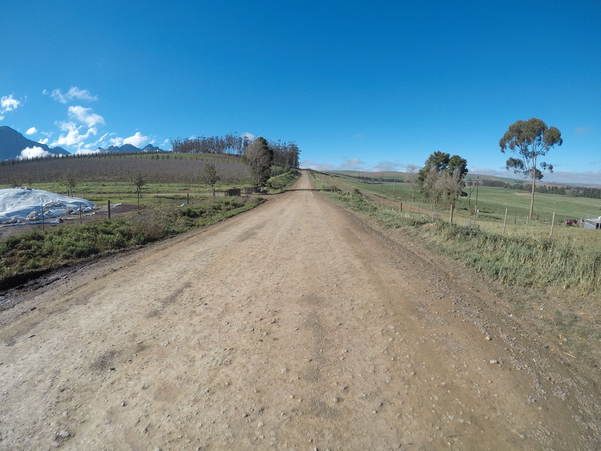
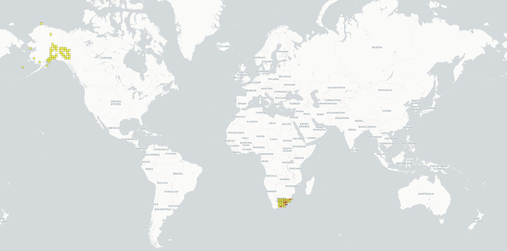
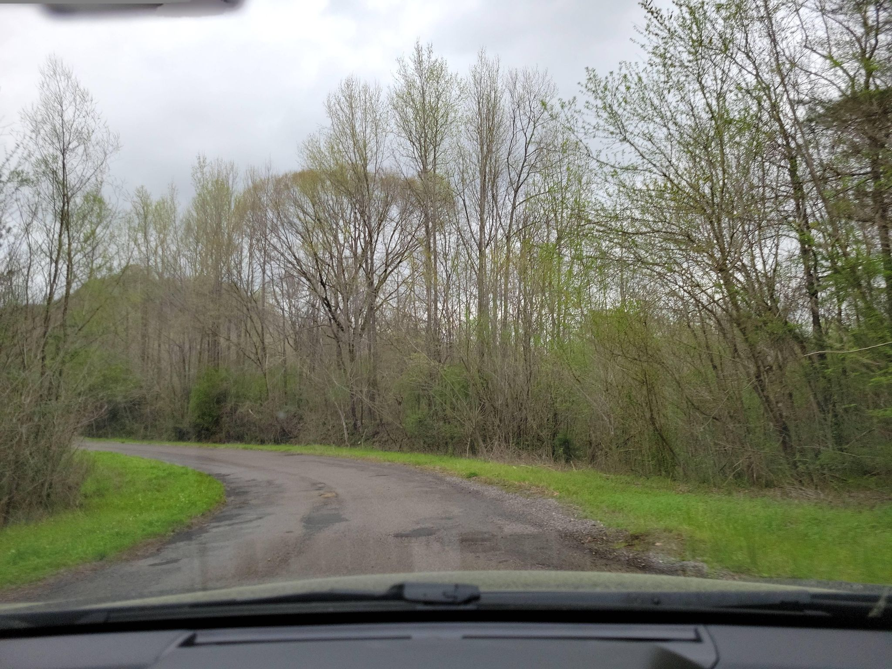
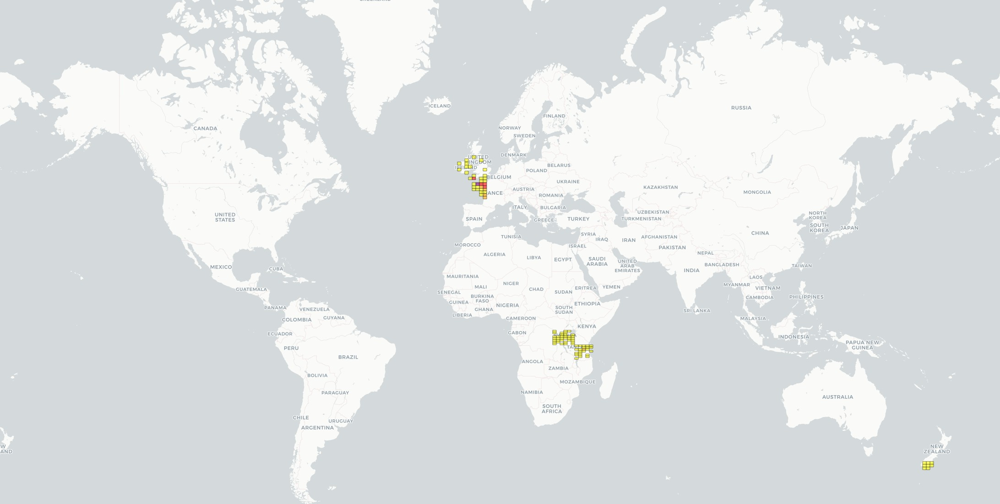

# Hierarchical Geolocation Classifier (Solo Project)

A computer vision project designed to predict the granular region in which a given image was taken.  
It leverages the Mapillary API to collect geotagged street-level imagery and automatically labels each image based on its GPS metadata.  
Four ResNet-50 convolutional neural networks are trained to classify images by location at four levels of spatial granularity, using a recursive grid system.  
The finest level divides the Earth into 65,536 equally sized grid cells.

---

## Inspiration & Evolution

I've been a geography nerd for years and a longtime fan of **GeoGuessr**, a game where you're dropped into a random location on Google Street View and must guess where you are in the world.  
This project started as an attempt to create a GeoGuessr "bot" to automate that guessing process. It evolved from this simple idea into a full ML pipeline spanning data collection, model training, geospatial visualization, and hierarchical inference.

While the final classifier struggles with accuracy, particularly at finer levels (L5 and L8), the project:

- Successfully trained and evaluated ResNet-50 models across four hierarchy depths using over 100,000 images
- Hierarchical inference logic (parent-child masking, adaptive top-k) was implemented and tested
- Visualization tools were built to map predictions, coverage, and data gaps across a global grid system
- Challenges in geolocation-by-image, such as class imbalance, visual ambiguity, and dataset bias, became clear through experimentation

---

## Sample Tests (more can be found in scripts/testing)

### Successful Test

<table>
  <tr>
    <td align="center" width="30%">
      <strong>Input Image (South Africa)</strong><br>
      
    </td>
    <td align="center" width="70%">
      <strong>Top-k Prediction Map</strong><br>
      
    </td>
  </tr>
</table>

### Unsuccessful Test

<table>
  <tr>
    <td align="center" width="30%">
      <strong>Input Image (USA)</strong><br>
      
    </td>
    <td align="center" width="70%">
      <strong>Top-k Prediction Map</strong><br>
      
    </td>
  </tr>
</table>

## Project Structure & Pipeline

### `fetch_images.py`
- Fetches and filters Mapillary images from each grid cell using the Mapillary API  
- Filters by image brightness and spatial redundancy using KDTree distance  
- Logs empty grid cells and saves successful images under `data/raw_images/<grid_id>/`  
- Designed for execution across ~16,000 L8 regions

### `visualize_valid_grids.py`
- Generates an interactive HTML map of all Level 8 grid cells, color-coded by status:  
  - 🟢 Green: Grid intersects land and has image data  
  - 🔵 Blue: Grid is ocean-only  
  - ⚪ Gray: Grid intersects land but no usable images found

### `organize_folders.py`
- Converts nested L8 folder structure into flat image datasets for L1, L3, and L5 levels  
- Truncates grid IDs to target depth (e.g., `0/1/2/3/0/1/1/2 → 0` for L1)  
- Copies and renames images into folders like `data/hierarchy_L3/0_1_2`  
- Prepares clean dataset splits for model training

### `create_label_map.py`
- Builds label maps and parent-child mappings between hierarchy levels  
  - `label_map_L*.pth`: maps folder paths to integer labels  
  - `l1_to_l3.pth`, `l3_to_l5.pth`, `l5_to_l8.pth`: maps parent class indices to child class indices  
- Used during masked inference to propagate predictions

### `train_model_{hierarchy_level}.py`
- Trains a ResNet-50 model on one hierarchy level (`L1`, `L3`, `L5`, or `L8`)  
- Applies data augmentation (resize, color jitter, horizontal flip)  
- Splits data into 80/20 train/val and tracks Top-1 / Top-10 accuracy  
- Saves model state to `models/hierarchy_L*.pth`

### `hierarchical_predict_and_visualize.py`
- Performs hierarchical inference on a single test image (`test.jpg`)  
- Passes image through L1 → L3 → L5 → L8 models using dynamic top-k and confidence thresholds  
- Applies temperature scaling per level if `*_temperature.txt` files are present (future implementation)  
- Uses hierarchical masking to reduce the label space at each level

### `generate_recursive_grids()` (in `grid_utils.py`)
- Recursively divides the globe into a hierarchical grid (up to 8 levels deep)  
- Generates bounding boxes for each grid ID  
- Filters to land-only grids using shapefiles (Natural Earth data)

---

## Output Files

- `valid_grid_map.html`: Output of `visualize_valid_grids.py`  
- `test_prediction_map.html`: HTML file output from `predict_image.py` that visualizes top-k predicted L8 regions on an interactive Folium map

## Testing

Sample test results for 10 locations can be found in `/scripts/testing/results/`.

To run your own predictions:
1. Place your test image in `/scripts/testing/tests/` and update the `IMAGE_PATH` in `hierarchical_predict_and_visualize.py`.
2. Download and place the following files:
   - In `/models/`: `hierarchy_L1.pth`, `hierarchy_L3.pth`, `hierarchy_L5.pth`, `hierarchy_L8.pth`
   - In `/scripts/label_maps/`:  
     - `label_map_L1.pth`, `label_map_L3.pth`, `label_map_L5.pth`, `label_map_L8.pth`  
     - `l1_to_l3.pth`, `l3_to_l5.pth`, `l5_to_l8.pth`
3. Run:  
   ```bash
   cd scripts/testing  
   python hierarchical_predict_and_visualize.py

## Challenges

### With This Project

#### Overconfident Training
- Model outputs are often overly confident on incorrect predictions

**Planned Improvements**:
- Apply label smoothing during training to soften class boundaries  
- Use temperature scaling post-training to calibrate softmax probabilities

#### Class Imbalance
- Lower-level grids (L8 grids) have extreme class imbalance (some regions have 100+ images, others only a few)

**Impact**:
- More misclassifications on general data

**Future Fixes**:
- Collect more balanced data  
- Discard underpopulated classes if necessary

#### Data Limitations
- Current augmentation is basic (flip, color jitter, resize); could be expanded (e.g., CutMix)  
- Some L8 regions (especially rural ones) have insufficient image density

---

### General Challenges in Geolocation by Image

#### Visual Ambiguity
- Many locations look visually similar (e.g., suburban roads, tree-lined streets), making it hard to localize from RGB alone

#### Dataset Bias
- Public datasets like Mapillary are skewed toward Western, urban environments

#### Lack of Context
- Without metadata (e.g., road signs, languages), deep models have little to depend on, limiting performance

---
